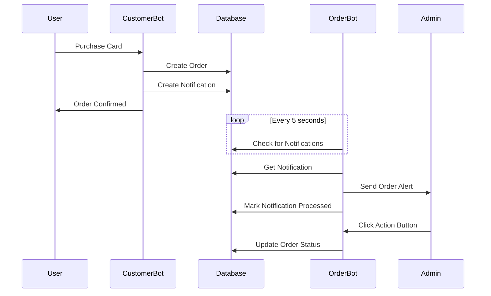

# Order Notification System

## Overview

The system now uses a **database-based notification queue** to handle communication between the customer bot and order management bot. When a user purchases a card, the customer bot creates a notification in the database, and the order bot processes it and sends a message to the admin.

## How It Works



## Database Schema

### New Collection: `notifications`

```javascript
{
  "notification_id": "notif_1693574400000",
  "type": "new_order",
  "data": {
    "order_id": "order_1693574400000",
    "user": {
      "id": 123456789,
      "first_name": "أحمد",
      "username": "ahmed123"
    },
    "card": {
      "card_type": "VISA 25$",
      "country_name": "الولايات المتحدة",
      "price": 25.0
    },
    "timestamp": "2025-09-01 21:30:00"
  },
  "status": "pending", // or "processed"
  "created_at": "2025-09-01T21:30:00Z",
  "processed_at": null
}
```

## Customer Bot Changes

### 1. Removed Direct Admin Messaging
- ❌ Old: `send_admin_notification()` - sent messages directly
- ✅ New: `create_order_notification()` - creates database notification

### 2. New Notification Creation
```python
async def create_order_notification(user, card, order_id):
    notification_data = {
        "order_id": order_id,
        "user": {
            "id": user.id,
            "first_name": user.first_name,
            "username": user.username
        },
        "card": {
            "card_type": card['card_type'],
            "country_name": card.get('country_name', 'غير محدد'),
            "price": card['price']
        },
        "timestamp": datetime.now().strftime('%Y-%m-%d %H:%M:%S')
    }
    
    await db_manager.create_notification("new_order", notification_data)
```

## Order Bot Changes

### 1. Background Notification Processor
- Runs every 5 seconds checking for new notifications
- Processes notifications and sends admin messages
- Marks notifications as processed

### 2. Enhanced Admin Messages
The order bot now sends rich notifications with action buttons:

```
🔔 طلب جديد!

👤 معلومات المستخدم:
🆔 ID: 123456789
👤 الاسم: أحمد
📧 اسم المستخدم: @ahmed123

🛒 تفاصيل الطلب:
🆔 رقم الطلب: order_1693574400000
🏷️ نوع البطاقة: VISA 25$
🌍 الدولة: الولايات المتحدة
💰 المبلغ: 25.0 USDT

⏰ وقت الطلب: 2025-09-01 21:30:00

يرجى إرسال تفاصيل البطاقة للمستخدم.

[✅ تم الإرسال] [❌ إلغاء الطلب] [📋 عرض التفاصيل]
```

### 3. Admin Action Buttons
- **✅ تم الإرسال**: Marks order as completed
- **❌ إلغاء الطلب**: Marks order as cancelled  
- **📋 عرض التفاصيل**: Shows full order details

## Database Methods Added

### Customer Bot & Order Bot
```python
# Create notification
await db_manager.create_notification("new_order", data)

# Get pending notifications (Order Bot)
notifications = await db_manager.get_pending_notifications()

# Mark notification as processed (Order Bot)
await db_manager.mark_notification_processed(notification_id)
```

## Benefits of This System

### ✅ **Separation of Concerns**
- Customer bot focuses on user experience
- Order bot handles all admin communications
- Clear responsibility boundaries

### ✅ **Reliability**
- Database-based queue ensures no lost notifications
- Automatic retry mechanism
- Persistent notification history

### ✅ **Scalability**
- Can handle high order volumes
- Background processing doesn't block user interactions
- Easy to add more notification types

### ✅ **Enhanced Admin Experience**
- Rich notifications with action buttons
- Order status tracking
- Detailed order information

### ✅ **Maintainability**
- Easy to modify notification formats
- Simple to add new notification types
- Clear audit trail of all notifications

## Configuration

### Environment Variables Required
```bash
# Both bots need these
ADMIN_USER_ID=your_telegram_user_id

# Customer bot
BOT_TOKEN=your_customer_bot_token

# Order management bot
ORDER_BOT_TOKEN=your_admin_bot_token
```

## Monitoring

### Check Notification Processing
```bash
# View order bot logs
docker-compose logs order-bot -f

# Check for notification processing messages
docker-compose logs order-bot | grep "notification"
```

### Database Queries
```javascript
// Check pending notifications
db.notifications.find({status: "pending"})

// Check processed notifications
db.notifications.find({status: "processed"})

// Check notification processing times
db.notifications.find({}, {
  notification_id: 1, 
  created_at: 1, 
  processed_at: 1,
  status: 1
})
```

## Troubleshooting

### Common Issues

1. **Admin not receiving notifications**
   - Check `ADMIN_USER_ID` is set correctly
   - Verify order bot is running: `docker-compose ps`
   - Check order bot logs: `docker-compose logs order-bot`

2. **Notifications stuck in pending**
   - Check order bot connection to database
   - Verify notification processor is running
   - Check for errors in order bot logs

3. **Duplicate notifications**
   - Each notification has unique ID based on timestamp
   - Processed notifications are marked to prevent reprocessing

### Manual Testing
```javascript
// Create test notification
db.notifications.insertOne({
  "notification_id": "test_notification",
  "type": "new_order",
  "data": {
    "order_id": "test_order",
    "user": {"id": 123, "first_name": "Test", "username": "test"},
    "card": {"card_type": "Test Card", "price": 10}
  },
  "status": "pending",
  "created_at": new Date()
})
```

## Future Enhancements

### Possible Additions
- **Email notifications** for admins
- **SMS alerts** for urgent orders
- **Webhook integrations** with external systems
- **Notification templates** for different order types
- **Admin notification preferences** (immediate vs batched)

The notification system provides a robust, scalable foundation for order management communications!
